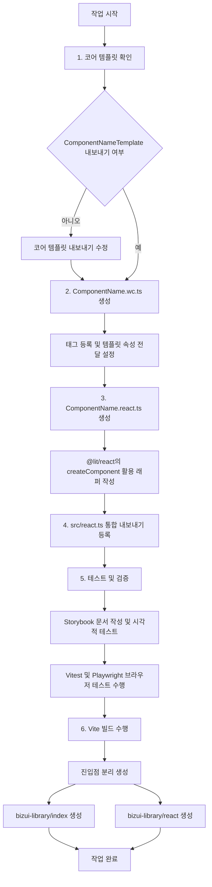

# Biz-UI 컴포넌트 라이브러리

## 프로젝트 개요

이 프로젝트는 Lit과 TypeScript를 기반으로 구축된 "Biz-UI"라는 UI 컴포넌트 라이브러리입니다. 재사용 가능한 웹 컴포넌트로 사용자 인터페이스를 구축할 수 있도록 설계되었습니다. 이 라이브러리는 다음과 같은 최신 웹 개발 도구 및 기술을 활용합니다.

* **Lit**: 효율적이고 가벼운 웹 컴포넌트를 제작하기 위해 사용합니다.
* **TypeScript**: 정적 타이핑 및 코드 유지보수성 향상을 위해 사용합니다.
* **Vite**: 번들링 및 개발 서버 도구로 활용하며, 빠른 HMR(Hot Module Replacement)과 최적화된 빌드를 제공합니다.
* **Storybook**: 컴포넌트를 독립된 환경에서 개발, 문서화, 테스트하기 위해 사용합니다.
* **Vitest**: 빠른 단위 테스트 프레임워크로, 브라우저 기반 테스트를 위해 Playwright와 연동되며 Storybook 스토리 테스트를 지원합니다.

## 개발 컨벤션

### 컴포넌트 구조

각 UI 컴포넌트는 `src/components/` 하위의 전용 디렉터리에 구성됩니다. 일반적인 컴포넌트 디렉터리 구성은 다음과 같습니다.

* `ComponentName.ts`: 컴포넌트 로직 및 템플릿이 작성된 메인 TypeScript 파일입니다.
* `ComponentName.css`: 컴포넌트 스타일링을 위한 CSS 파일입니다.
* `ComponentName.stories.ts`: 컴포넌트 사용법 및 상태를 시연하는 Storybook 파일입니다.
* `ComponentName.test.ts` (명시되진 않았으나 추정됨): 컴포넌트 전용 테스트 파일입니다.
* `index.ts`: 컴포넌트 및 타입을 내보내어 모듈 가져오기를 용이하게 하는 파일입니다.

### 프레임워크 지원 및 래퍼(Wrapper)

라이브러리는 계층형 아키텍처를 통해 여러 프레임워크를 지원합니다.

1. **코어 템플릿 (`.ts`)**: UI 구조를 정의하는 순수 Lit 순수 함수 형태의 템플릿입니다.
2. **웹 컴포넌트 (`.wc.ts`)**: 커스텀 엘리먼트를 등록하고 코어 템플릿을 감싸는 `LitElement` 클래스입니다.
3. **프레임워크 래퍼 (예: `.react.ts`)**: 프레임워크 고유의 사용감을 제공하기 위한 전용 래퍼입니다 (예: 적절한 Prop 타입 및 이벤트 바인딩을 포함한 React 컴포넌트).

#### 프레임워크 지원을 위한 파일 구조

```text
src/components/ComponentName/
├── ComponentName.ts         # 코어 템플릿 (*Template 형태로 명칭 변경)
├── ComponentName.wc.ts      # 웹 컴포넌트 (커스텀 엘리먼트 등록)
├── ComponentName.react.ts   # React 래퍼 (@lit/react 사용)
└── index.ts                 # 통합 내보내기 파일

```

#### 새로운 React 래퍼 추가 절차

1. 코어 템플릿이 `ComponentNameTemplate`으로 내보내졌는지 확인합니다.
2. `ComponentName.wc.ts`를 생성하여 태그(예: `biz-component-name`)를 등록하고 템플릿에 속성(Props)을 전달합니다.
3. `@lit/react`의 `createComponent`를 사용하여 `ComponentName.react.ts`를 생성합니다.
4. 통합 접근을 위해 `src/react.ts`에서 새 래퍼를 내보냅니다.

#### 빌드 및 배포

빌드 과정에서 코어 라이브러리와 프레임워크 전용 래퍼에 대한 진입점(Entry point)이 각각 생성됩니다.

* `bizui-library/index`: 순수 웹 컴포넌트
* `bizui-library/react`: React 전용 래퍼

### 스타일링

* CSS는 컴포넌트와 동일한 위치에 생성됩니다.
* CSS 클래스 이름은 주로 `biz-component-name` 또는 `component-name` 패턴을 따릅니다.

### 테스트 및 문서화

* **Storybook**: 모든 컴포넌트는 대응하는 Storybook 스토리(`*.stories.ts`)를 가지며, 이는 대화형 개발 환경이자 최신 문서 역할을 합니다.
* **Vitest**: Vitest를 통해 단위 및 통합 테스트가 설정되어 있으며, Playwright를 통한 브라우저 테스트 및 Storybook 스토리 연동 테스트를 지원합니다.
* **접근성(Accessibility)**: 접근성을 고려한 컴포넌트 개발을 위해 Storybook 접근성 애드온(`@storybook/addon-a11y`)이 설정되어 있습니다.

### TypeScript 설정

`tsconfig.json` 파일은 ES2023을 타깃으로 하는 최신 TypeScript 설정을 나타내며, `bundler` 모듈 해석 및 엄격한 린팅 규칙(`noUnusedLocals`, `noUnusedParameters`)을 적용하고 있습니다.

## 주요 파일

* `package.json`: 프로젝트 메타데이터, 의존성 및 스크립트를 정의합니다.
* `tsconfig.json`: TypeScript 컴파일러를 설정합니다.
* `vite.config.ts` (명시되진 않았으나 Vite 사용 시 존재): Vite 빌드 도구 설정 파일입니다.
* `.storybook/main.ts`: Storybook 스토리 위치 및 애드온 설정 파일입니다.
* `.storybook/preview.ts`: Storybook 전역 파라미터 및 데코레이터 설정 파일입니다.
* `vitest.config.ts`: 브라우저 테스트 설정을 포함한 Vitest 설정 파일입니다.
* `src/index.ts`: 모든 컴포넌트를 내보내는 메인 진입점 파일입니다.
* `src/components/ComponentName/index.ts`: 개별 컴포넌트 내보내기 파일입니다.
* `index.html`: 로컬 개발 및 미리보기에 사용되는 메인 HTML 파일입니다.

---

## 신규 React 래퍼 컴포넌트 추가 작업 공정 (Mermaid)

